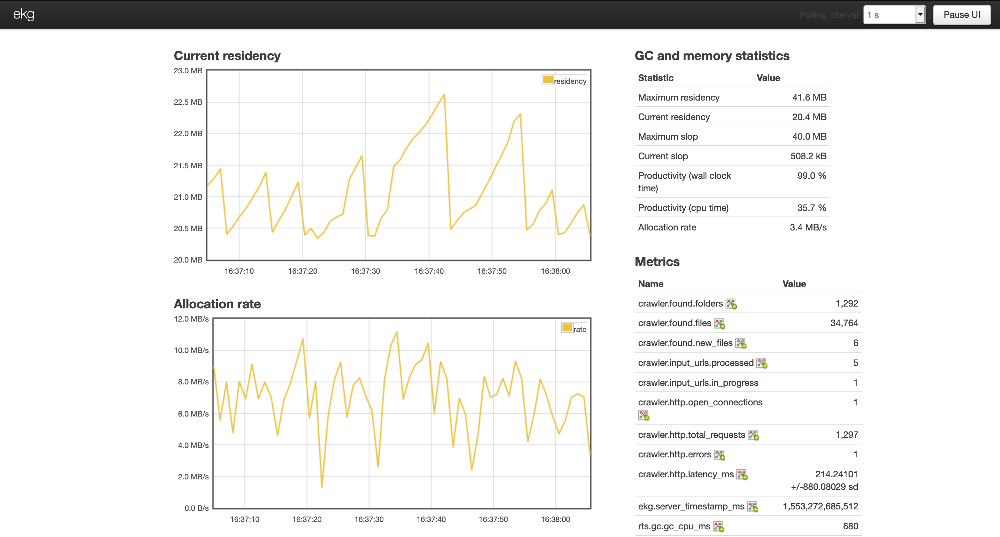

# od-crawler

[](https://travis-ci.org/agourlay/od-crawler)

Crawler for open directories.

`Open directories are unprotected directories of pics, vids, music, software and otherwise interesting files.`

## Usage

```
./od-crawler-exe -h
Usage: od-crawler-exe TARGET [-p|--profile PROFILE] [-v|--verbose]
                      [-d|--directory DIRECTORY]
  Crawls open directories for interesting links

Available options:
  TARGET                   The target URL or the path to the file containing the
                           target URLs (one per line)
  -p,--profile PROFILE     Profile for allowed extensions (Videos, Pictures,
                           Music, Docs, SubTitles)
  -v,--verbose             Enable verbose mode for debugging purpose
  -d,--directory DIRECTORY The folder where to persist results - only new
                           entries will be shown
  --parallel               Crawl target URLS in parallel
  --monitoring             The monitoring port where metrics are exposed - http://localhost:$port
  -h,--help                Show this help text
```

- Examples

```
./od-crawler-exe http://that.cool.od.site.com
```

Filter by file extension

```
./od-crawler-exe http://that.cool.od.site.com -p Videos
```

The ouput can of course be redirected to a file to enable later search.

```
./od-crawler-exe http://that.cool.od.site.com -p Videos > results.txt
```

In order to crawl several URLs at once, a file containing one URL per line can be used as input.

```
./od-crawler-exe ~/links.txt -p Videos
```

It is possible to save the result of a run in a folder.
Not only will you be able to grep those files later on but the console will only display new items in the next run to save you the diff process.

```
./od-crawler-exe ~/links.txt -d ~/od-crawler/ -p Videos
```

For more power, let's crawl URLs in parallel! (max 10 URLs for the time being)

```
./od-crawler-exe ~/links.txt -d ~/od-crawler/ -p Videos --parallel
```

A web monitoring interface can be enabled to follow the overall progress and the internal metrics of the crawler.

```
./od-crawler-exe ~/links.txt -d ~/od-crawler/ -p Videos --parallel --monitoring 8000
```

Then open `http://localhost:8000` to access the [EKG console](https://github.com/tibbe/ekg)

